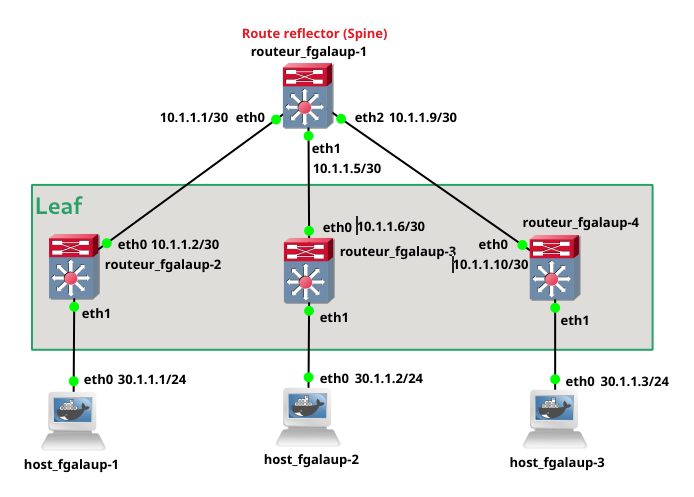

#  Part 3: Discovering BGP with EVPN

In this third part of the project, we will have to implement a so-called "spine-and-leaf" architecture.
This will consist of a single main router which will act as a route reflector (spine).
There will also be three sub-routers acting as leafs (VTEPs), all of which will be connected to the spine.
And finally three hosts, each connected to a different leaf.

In the spine-leaf architecture, each spine is systematically connected to each leaf.
You can add for scalability and redundancy reasons, several spines.
The other advantage of this architecture is that it allows any leaf to be connected to each other with just one hop, which guarantees good latency.

An example of a spine-leaf architecture is the following:


## Setup

## Create the network structure (router, host and link)

The current network diagram is the following:



### router-1 (Route reflector)

The purpose of the route reflector is to use the BGB-EVPN protocol to share information (MAC mapping table / IP VTEPs) more efficiently between all the different VTEPs.

Configure route reflector:

```bash
vtysh # Use vtysh to configure the router
configure terminal # Enter in configuration mode

hostname fgalaup_routeur-1
no ipv6 forwarding
!
# Configure the interfaces (give them an IP address)
interface eth0
    ip address 10.1.1.1/30
!
interface eth1
    ip address 10.1.1.5/30
!
interface eth2
    ip address 10.1.1.9/30
!
interface lo
    ip address 1.1.1.1/32
!
# Configure BGP in ASN 1
router bgp 1
    neighbor ibgp peer-group
    neighbor ibgp remote-as 1
    neighbor ibgp update-source lo
    bgp listen range 1.1.1.0/29 peer-group ibgp
    !
    address-family l2vpn evpn
        neighbor ibgp activate
        neighbor ibgp route-reflector-client
    exit-address-family
!
router ospf
    network 0.0.0.0/0 area 0
!
line vty
!
```

### router-2 (leaf 1)

```bash
# Create the bridge and the vxlan interface
ip link add br0 type bridge
ip link set dev br0 up
ip link add vxlan10 type vxlan id 10 dstport 4789
ip link set dev vxlan10 up
brctl addif br0 vxlan10
brctl addif br0 eth1

vtysh # Use vtysh to configure the router
configure terminal # Enter in configuration mode

# Configure the interfaces (give them an IP address)
hostname fgalaup_routeur-2
no ipv6 forwarding
!
interface eth0
    ip address 10.1.1.2/30
    ip ospf area 0
!
interface lo
    ip address 1.1.1.2/32
    ip ospf area 0
!

# Configure BGP in ASN 1
router bgp 1
    neighbor 1.1.1.1 remote-as 1
    neighbor 1.1.1.1 update-source lo
    !
    address-family l2vpn evpn
        neighbor 1.1.1.1 activate
        advertise-all-vni
    exit-address-family
!

router ospf
!

```

### router-3 (leaf 2)

We do not add this router to the vxlan for demonstration purpose.

```bash
vtysh # Use vtysh to configure the router
configure terminal # Enter in configuration mode

hostname fgalaup_routeur-3
no ipv6 forwarding
!
interface eth0
    ip address 10.1.1.6/30
    ip ospf area 0
!
interface lo
    ip address 1.1.1.3/32
    ip ospf area 0
!
router bgp 1
    neighbor 1.1.1.1 remote-as 1
    neighbor 1.1.1.1 update-source lo
    !
    address-family l2vpn evpn
        neighbor 1.1.1.1 activate
    exit-address-family
!
router ospf
!

```


### router-4 (leaf 3)

```bash
ip link add br0 type bridge
ip link set dev br0 up
ip link add vxlan10 type vxlan id 10 dstport 4789
ip link set dev vxlan10 up
brctl addif br0 vxlan10
brctl addif br0 eth1

vtysh # Use vtysh to configure the router
configure terminal # Enter in configuration mode

hostname fgalaup_routeur-4
no ipv6 forwarding
!
interface eth0
    ip address 10.1.1.10/30
    ip ospf area 0
!
interface lo
    ip address 1.1.1.4/32
    ip ospf area 0
!
router bgp 1
    neighbor 1.1.1.1 remote-as 1
    neighbor 1.1.1.1 update-source lo
    !
    address-family l2vpn evpn
        neighbor 1.1.1.1 activate
        advertise-all-vni
    exit-address-family
!
router ospf
!

```

### host-1
`ip address add 30.1.1.1/24 dev eth0`

### host-2
`ip address add 30.1.1.2/24 dev eth0`

### host-3
`ip address add 30.1.1.3/24 dev eth0`


# Explain configuration (Line by line)

```bash
hostname <name> # Give an hostname to the machine
no ipv6 forwarding # Disable ipv6 routing we dont need support for the project

#configuring an network interface
interface <interface_name>
    ip address <ip_address>/<mask>
    ip ospf area <area_id> # Add this interface to ospf area 0 ??? Add more info

# Loopback interface
# A loopback interface is used for device identification. Although you can use any interface address to determine if the device is online. 
# Network topology changes can remove interfaces or change addresses, but the loopback address never changes.

interface lo
    ip address <ip_address>/<mask>
    ip ospf area <area_id> # Add this interface to ospf area ??? Add more info

# Configure BGP in ASN 1
router bgp 1

    # Config of the route reflector

    neighbor <peer_group_name> peer-group # Create a peer group 
    neighbor <peer_group_name> remote-as <ASN> # 
    neighbor <peer_group_name> update-source lo # Use the loopback interface to communicate with the neighbor
    bgp listen range 1.1.1.0/29 peer-group <peer_group_name> # Accept connections from any peers in the specified prefix. Configuration from the specified peer-group is used to configure these peers

    # Config of the EVPN
    # Address family is used to configure the BGP to handle a specific network protocol in this case EVPN.
    # Etch rule inside the address family is used to configure the protocol.
    address-family l2vpn evpn
        neighbor ibgp activate # Allow the router to communicate with the neighbor to send BGP-EVPN info (routes)
        neighbor ibgp route-reflector-client # Add all neighbors as route reflector clients
    exit-address-family


    # Config of the route reflector client
    neighbor <ip_address> remote-as 1 # Add a neighbor in the same AS with loopback address as identifier
    neighbor <ip_address> update-source lo # Use the loopback interface to communicate with the neighbor (route reflector)
    
    # Config of the EVPN

    address-family l2vpn evpn # Configure the address family
        neighbor <ip_address> activate # Allow the router to communicate with the specified neighbor to send BGP-EVPN info (routes)
        advertise-all-vni # Advertise all VNI (VXLAN Network Identifier)
    exit-address-family
!

# Configure OSPF
router ospf

router ospf
    # This command specifies the OSPF enabled interface(s). If the interface has an address from range 192.168.1.0/24 then the command below enables ospf on this interface so router can provide network information to the other ospf routers via this interface.
    network 0.0.0.0/0 area 0
```


## Sources
- [Tuto for project part 3](https://www.youtube.com/watch?v=Ek7kFDwUJBM)

https://vincent.bernat.ch/fr/blog/2017-vxlan-bgp-evpn
https://www.youtube.com/watch?v=YNqKDI_bnPM&list=PLDQaRcbiSnqFe6pyaSy-Hwj8XRFPgZ5h8

https://www.juniper.net/fr/fr/research-topics/what-is-evpn-vxlan.html
https://www.dir-tech.com/architecture-reseau-spine-leaf/